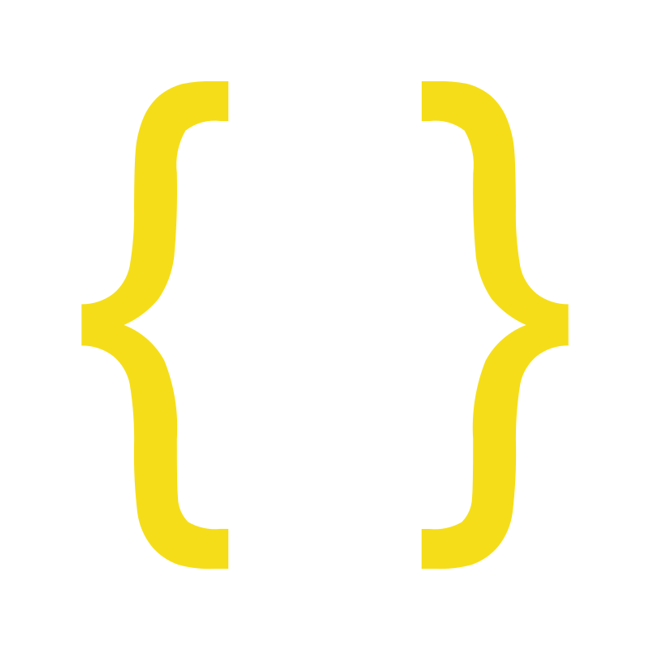

``` java
    System.out.println("Hi evryone, \n I am...")
```


**Software Developer · IT · Automation · Experimental Technologies**

I build software, automate processes and explore new technologies.

## 🧪 What I build

- Software & web applications
- Automation & integrations
- APIs & backend systems
- Developer tools
- Infrastructure & containerized environments
- Experimental projects & prototypes

---

``` python
class Developer:
    def __init__(self):
        self.name = "Piotr"
        self.country = "Poland"
        self.github = "github.com/piotrszwedo"
        self.editors = ["PhpStorm", "Visual Studio Code", "PyCharm", "IntelliJ"]
        
    def find_me(self, your_name):
        print("LinkedIn — linkedin.com/in/piotrszwedo")
        print("Email — piotrszwedo2007@gmail.com"
```
---

## 🛠 Tech Stack

<div align="center">

### Languages

<table>
  <tr>
    <td align="center"><br>Python</td>
    <td align="center"><br>TypeScript</td>
    <td align="center"><br>Go</td>
    <td align="center"><br>Java</td>
    <td align="center"><br>JavaScript</td>
    <td align="center"><br>PHP</td>
  </tr>
</table>

### Web & Data

<table>
  <tr>
    <td align="center"><br>HTML</td>
    <td align="center"><br>CSS</td>
    <td align="center"><br>JSON</td>
    <td align="center"><br>SQL</td>
    <td align="center"><br>MySQL</td>
  </tr>
</table>

### Infrastructure & Tools

<table>
  <tr>
    <td align="center"><br>Docker</td>
    <td align="center"><br>Git</td>
    <td align="center"><br>n8n</td>
    <td align="center"><br>WordPress</td>
  </tr>
</table>

### Environments

<table>
  <tr>
    <td align="center"><br>Fedora</td>
    <td align="center"><br>Ubuntu</td>
    <td align="center"><br>Windows</td>
  </tr>
</table>

</div>

---

## 🔬 Projects

### [ESKUEL](https://github.com/PiotrSzwedo/ESKUEL)

An educational application for working with databases.
ESKUEL supports standard SQL as well as a Polish-inspired SQL syntax.

### [Termy-backend](https://github.com/smartfrigde/termy-backend)

An API and proxy server for managing SSH and GPG keys,
designed for developers, system administrators and teams.

More experiments and projects can be found across my repositories.

---

## 🌐 Find me

- 💼 **LinkedIn** — [linkedin.com/in/piotrszwedo](https://linkedin.com/in/piotrszwedo)
- 📧 **Email** — piotrszwedo2007@gmail.com

---
